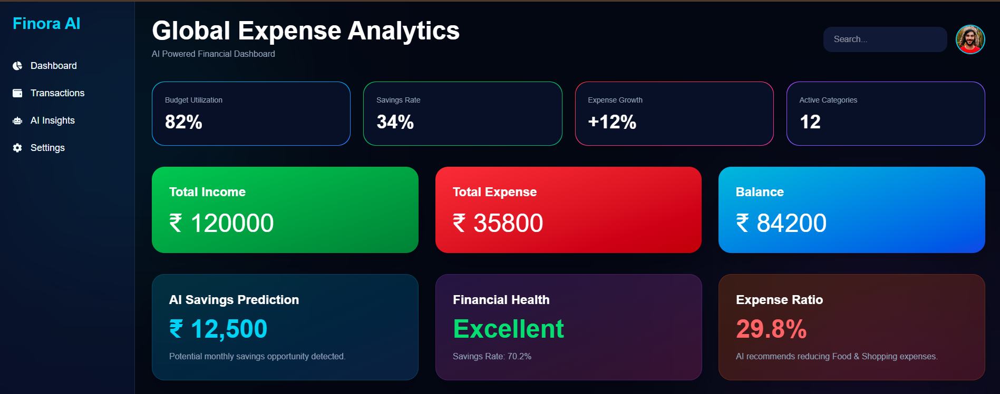
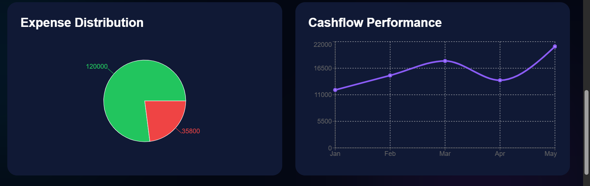
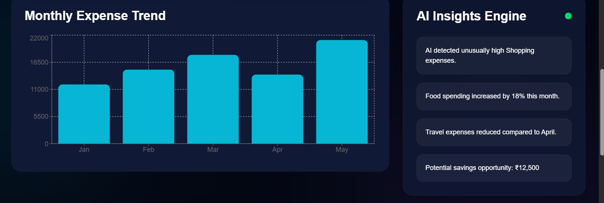
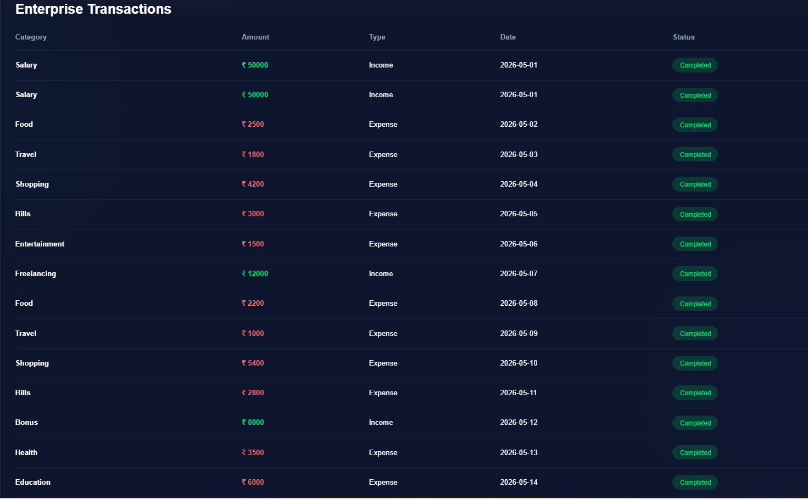
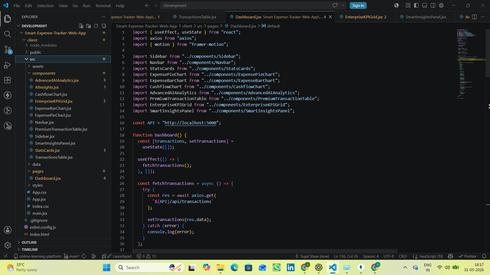

# 🚀 AI Financial Intelligence Dashboard Platform

<div align="center">


<br/>

### 💎 Enterprise AI-Powered Financial Analytics Dashboard

Modern SaaS-inspired fintech intelligence platform built using the MERN Stack with enterprise analytics, AI-driven insights, animated dashboards, premium UI architecture, and scalable full-stack engineering practices.

</div>

---

# 📌 Project Overview

AI Financial Intelligence Dashboard Platform is a premium full-stack fintech analytics application designed to simulate modern enterprise-grade financial intelligence systems.

The platform transforms traditional expense tracking into a visually rich and data-driven analytics experience inspired by real-world SaaS products like:

* Stripe Analytics
* Ramp Finance
* Brex
* Enterprise BI Platforms
* Modern Fintech Dashboards

The system focuses heavily on:

* enterprise dashboard architecture
* scalable frontend engineering
* component-based UI systems
* analytics visualization
* AI-inspired financial insights
* modern SaaS experience design

---

# ✨ Core Features

## 💎 Enterprise Dashboard UI

* Futuristic dark fintech theme
* Glassmorphism UI system
* Responsive analytics layout
* Dense enterprise dashboard hierarchy
* Premium neon gradients & glow effects

---

## 📊 Advanced Financial Analytics

* Expense distribution analytics
* Monthly expense trends
* Cashflow performance charts
* KPI metric monitoring
* Real-time financial overview cards

---

## 🧠 AI Financial Intelligence

* Smart savings prediction
* Spending pattern analysis
* Expense ratio monitoring
* Financial health scoring
* AI-powered insights engine

---

## 💳 Enterprise Transaction System

* Transaction management
* Dynamic financial records
* Status indicators
* Categorized expense system
* Enterprise-grade data tables

---

## ⚡ Premium User Experience

* Framer Motion animations
* Smooth hover transitions
* Interactive chart systems
* Animated widgets
* SaaS-inspired UX flow

---

# 🏗 Workflow Architecture

```text
User Interaction
        ↓
React Frontend (Vite + Tailwind)
        ↓
Dashboard Components
        ↓
Axios API Requests
        ↓
Express.js REST APIs
        ↓
MongoDB Database
        ↓
Analytics Processing
        ↓
AI Insight Generation
        ↓
Dynamic Dashboard Rendering
```

---

# 🧠 System Design Highlights

## Frontend Engineering

* Component-based scalable architecture
* Modular dashboard widgets
* Reusable analytics components
* Responsive grid systems
* Enterprise UI hierarchy

---

## Backend Engineering

* RESTful API architecture
* MongoDB document modeling
* Scalable route structure
* Centralized API communication
* Analytics-ready backend design

---

## Analytics Layer

* Financial KPI computation
* Dynamic chart rendering
* Expense categorization
* Cashflow analytics
* Real-time dashboard metrics

---

# 📊 Dashboard Modules

| Module              | Description                      |
| ------------------- | -------------------------------- |
| KPI Engine          | Financial metrics & insights     |
| Analytics Dashboard | Interactive chart systems        |
| Transaction Engine  | Financial data management        |
| AI Insight Layer    | Predictive financial suggestions |
| Enterprise Table    | Structured transaction analytics |
| Chart Engine        | Recharts-powered visualizations  |
| UI Animation Layer  | Framer Motion interactions       |

---

# 🛠 Tech Stack

| Technology    | Purpose                 |
| ------------- | ----------------------- |
| React.js      | Frontend Framework      |
| Node.js       | Backend Runtime         |
| Express.js    | REST API Layer          |
| MongoDB       | NoSQL Database          |
| Tailwind CSS  | UI Styling              |
| Framer Motion | UI Animations           |
| Recharts      | Analytics Visualization |
| Axios         | API Communication       |
| Vite          | Frontend Build Tool     |

---

# 📂 Project Structure

```bash
src/
│
├── components/
│   ├── Sidebar.jsx
│   ├── Navbar.jsx
│   ├── StatsCards.jsx
│   ├── ExpensePieChart.jsx
│   ├── ExpenseBarChart.jsx
│   ├── CashflowChart.jsx
│   ├── AIInsights.jsx
│   ├── AdvancedAIAnalytics.jsx
│   ├── EnterpriseKPIGrid.jsx
│   ├── SmartInsightsPanel.jsx
│   ├── PremiumTransactionTable.jsx
│
├── pages/
│   └── Dashboard.jsx
│
├── data/
│   └── mockData.js
│
├── App.jsx
├── main.jsx
```

---

# 📸 Screenshot Showcase

## 💎 Enterprise Dashboard



---

## 📊 Expense Distribution Analytics



---

## 📈 Cashflow Performance



---

## 💳 Enterprise Transactions



---

## 🧱 Project Structure



---

# ⚙️ Installation & Setup

## 1️⃣ Clone Repository

```bash
git clone https://github.com/YOUR_USERNAME/ai-financial-intelligence-dashboard.git
```

---

## 2️⃣ Backend Setup

```bash
cd server

npm install

npm run server
```

---

## 3️⃣ Frontend Setup

```bash
cd client

npm install

npm run dev
```

---

# 🔑 Environment Variables

Create a `.env` file inside `server/`

```env
PORT=5000

MONGO_URI=mongodb://127.0.0.1:27017/expenseTracker

JWT_SECRET=smartExpenseSecret
```

---

# 🚀 Scalability & Engineering Considerations

The platform architecture was intentionally designed with scalability in mind.

### Current Engineering Patterns

* Modular component architecture
* Analytics-focused UI systems
* REST API separation
* Reusable chart components
* Dynamic financial computation

### Future Production Extensions

* JWT authentication
* Role-based access control
* AI API integrations
* Cloud deployment
* WebSocket real-time updates
* Multi-user finance systems
* PDF/CSV exports
* Real-time notifications

---

# 📚 Learning Outcomes

This project helped strengthen understanding of:

* Full-stack MERN architecture
* Enterprise dashboard engineering
* Modern frontend system design
* Analytics visualization systems
* API integration workflows
* Scalable React architecture
* UI animation systems
* SaaS product design patterns

---

# 💼 Resume Project Title

```txt
AI Financial Intelligence Dashboard Platform
```

---

# 🧠 Resume Description

```txt
Built a full-stack AI-powered financial analytics dashboard using MERN Stack with enterprise-grade UI, advanced analytics, animated visualizations, AI-driven insights, and scalable SaaS-inspired architecture.
```

---

# 🌐 GitHub Repository

```bash
https://github.com/YOUR_USERNAME/ai-financial-intelligence-dashboard
```

---

# 👨‍💻 Author

## Sujal Kumar Shaw

### Full Stack Developer • MERN Stack Enthusiast • AI Projects Builder

---

# ⭐ Support

If you found this project useful:

⭐ Star the repository
🍴 Fork the project
🚀 Share it with others

---

<div align="center">

# 💎 Built with modern technologies and scalable architecture 💎

</div>
